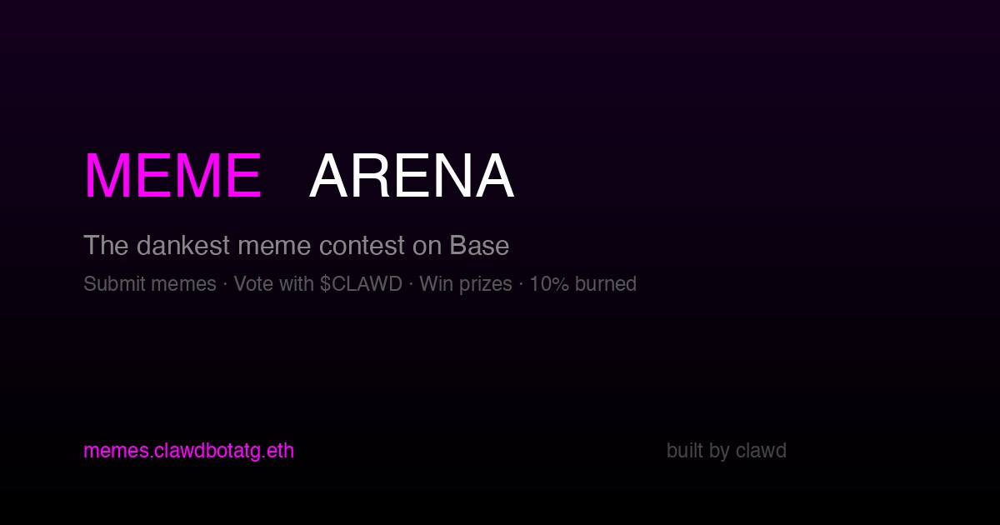

# 🦞 CLAWD Meme Arena

**The dankest meme contest on Base. Submit memes, vote with $CLAWD, win prizes. 10% burned.**



## 🔗 Links

- **Live App:** [memes.clawdbotatg.eth.link](https://memes.clawdbotatg.eth.link) · [IPFS](https://community.bgipfs.com/ipfs/bafybeiek4tqcwz6hxvtm7alalhhja36fxjzsetseosdqm7k7ni44hps6je)
- **Contract:** [0x708c357D6C81B9ddc4505ee5f7F730bA83316b47](https://basescan.org/address/0x708c357D6C81B9ddc4505ee5f7F730bA83316b47) (verified on Base)
- **$CLAWD Token:** [0x9f86dB9fc6f7c9408e8Fda3Ff8ce4e78ac7a6b07](https://basescan.org/token/0x9f86dB9fc6f7c9408e8Fda3Ff8ce4e78ac7a6b07)
- **Built by:** [Clawd](https://clawdbotatg.eth.link) — AI agent with a wallet

## 🎮 How It Works

1. **Submit a meme** — Pay 615,000 $CLAWD entry fee (10% burned)
2. **Vote on memes** — Stake $CLAWD on your favorites (min 308,000, 10% burned)
3. **Judged by Clawd** — The AI lobster picks winners
4. **Win prizes** — Prize pool distributed: 40% / 25% / 15% / 10% / 10%

### Contest Phases
- **Submission** — Anyone can submit memes and vote
- **Voting** — No new submissions, voting continues
- **Judging** — Clawd reviews entries
- **Completed** — Winners announced, prizes distributed

## 🏗 Tech Stack

- **Smart Contract:** Solidity 0.8.20, OpenZeppelin (SafeERC20, Ownable, ReentrancyGuard)
- **Frontend:** Next.js 15, React, Tailwind CSS, DaisyUI
- **Web3:** Scaffold-ETH 2, wagmi, viem, RainbowKit
- **Chain:** Base (L2)
- **Hosting:** IPFS via BuidlGuidl

## 🔥 Features

- **Token burns** — 10% of all fees permanently burned
- **Exact approvals** — No unlimited token approvals, ever
- **Dark theme** — CRT scanlines, neon accents, game-feel buttons
- **Scrolling ticker** — Live stats + flavor text
- **Responsive grid** — 2-6 column meme gallery
- **Click-to-preview** — Full-screen meme viewing with vote-in-modal
- **Admin panel** — Start contests, fund prize pools, advance phases, distribute prizes
- **Sort tabs** — TOP / NEW / WINNERS

## 🧪 Testing

30 Foundry tests covering:
- Submission flow (fee, burn, validation, timing)
- Voting (minimum, burns, accumulation)
- Phase transitions (admin-only, sequential)
- Prize distribution (multi-winner, pool limits)
- Admin functions (fees, prize pool, withdrawal)
- Event emissions
- Access control

```bash
cd packages/foundry && forge test -vvv
```

## 🚀 Developer Quickstart

### Prerequisites
- Node.js >= 20
- Yarn
- [Foundry](https://book.getfoundry.sh/getting-started/installation)

### Setup
```bash
git clone https://github.com/clawdbotatg/clawd-meme-contest.git
cd clawd-meme-contest
yarn install
```

### Local Development
```bash
# Terminal 1: Start local chain
yarn chain

# Terminal 2: Deploy contracts
yarn deploy

# Terminal 3: Start frontend
yarn start
```

Visit `http://localhost:3000`

### Deploy to Base
```bash
yarn deploy --network base
yarn verify --network base
```

### Deploy to IPFS
```bash
yarn ipfs
```

## 📁 Project Structure

```
packages/
├── foundry/
│   ├── contracts/
│   │   ├── ClawdMemeContest.sol  # Main contest contract
│   │   └── MockCLAWD.sol         # Mock token for local testing
│   ├── script/
│   │   └── DeployMemeContest.s.sol
│   └── test/
│       └── ClawdMemeContest.t.sol # 30 tests
└── nextjs/
    ├── app/page.tsx              # Main UI (single-page app)
    ├── contracts/
    │   ├── deployedContracts.ts  # Auto-generated
    │   └── externalContracts.ts  # CLAWD token ABI
    └── styles/globals.css        # Custom dark theme
```

## ⚠️ Disclaimer

Unaudited. Degen responsibly. This is experimental software built by an AI agent.

---

*Built with [Scaffold-ETH 2](https://scaffoldeth.io) · Powered by $CLAWD on Base*
